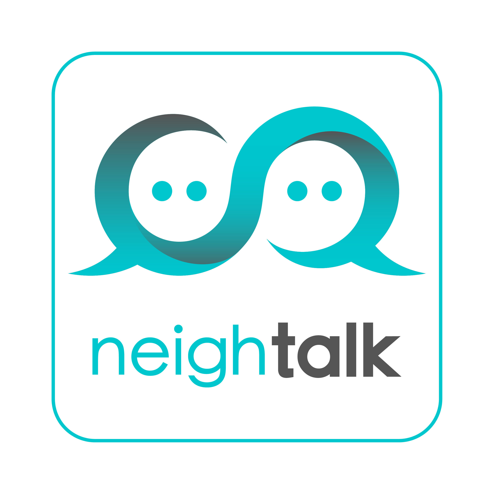
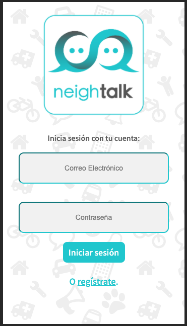
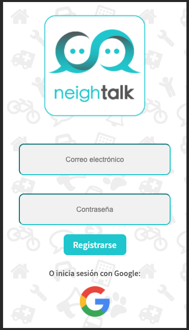
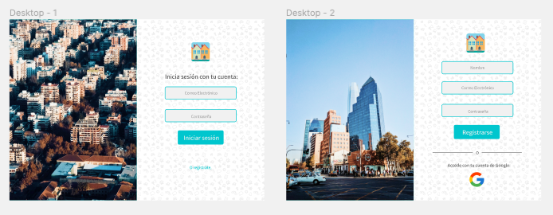
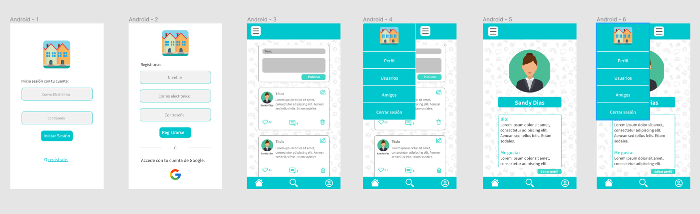
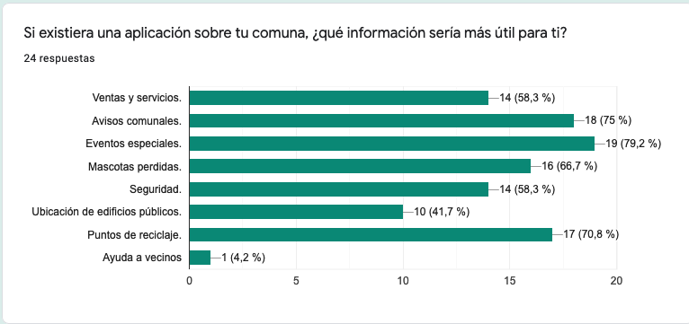
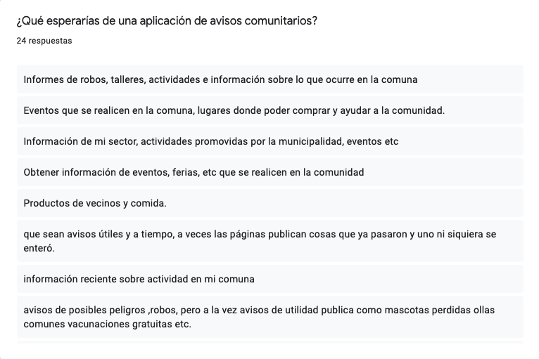
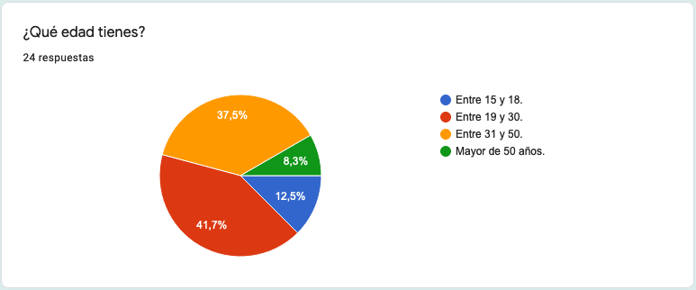
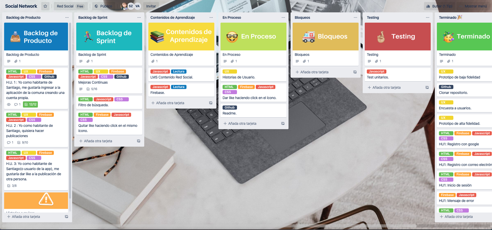

# NeighTalk

## Índice:

* [1. NeighTalk: Red Social Comunitaria.](#1-NeighTalk:-Red-Social-Comunitaria)
* [2. Comenzando a usarla.](#2-Comenzando-a-usarla)
* [3. Proceso de protoripado.](#3-Proceso-de-protoripado)
* [4. User Research.](#4-User-Research)
* [5. Historias de usuario.](#5-Historias-de-usuario)
* [6. Objetivos de Aprendizaje.](#6-Objetivos-de-Aprendizaje)
* [7. Despliegue.](#8-Despliegue)
* [8. Herramientas.](#9-Herramientas)
* [9. Autoras.](#10-Autoras)

***

## 1. NeighTalk: Red Social Comunitaria. :speech_balloon:

Neightalk es una red social enfocada a la comunidad. Un servicio que sus usuarios agradecerán al dejar atrás los grupos de comunas en Facebook o rescatando lo mejor de la inmediatez de twitter.
Neightalk viene a cubrir la necesidad de un grupo de personas entregando las herramientas para que cualquiera de sus usuarios pueda reportar sucesos o eventos en la comuna en la que se encuentre.
Puedes conocerla y probarla [aquí](https://social-network-proyect.web.app/).

## 2. Comenzando a usarla 🚀

Neightalk está pensada como un SPA(Single Page Aplication) Responsive pensada y desarrollada con la técnica Mobile First, sin embargo, también se puede utilizar desde el navegador que el usuario elija.
Basta con registrarse a través de un correo electrónico o contraseña, o, iniciar sesión con Google para acceder a la app y poder hacer publicaciones.

 

## 3. Proceso de prototipado 📋

#### Prototipo de baja fidelidad:
Comenzamos construyendo un prototipo de baja fidelidad en InVision, planificando el flujo de trabajo y todo lo que proyectamos incluír en la web app.
Puedes revisarlo [aquí](https://victoriaancalaf863833.invisionapp.com/freehand/Red-Social-LZshkZbYx).

#### Prototipo de alta fidelidad:
El prototipo de alta fidelidad fue diseñado a través de la plataforma que ofrece Figma, dando énfasis en cómo luciría y el funcionamiento planeado.
Puedes revisarlo [aquí](https://www.figma.com/proto/sBhHcoydNjATT6ITZg6RO3/Red-Social?node-id=1%3A2&viewport=197%2C514%2C0.5261549949645996&scaling=scale-down).
 

## 4. User Research :busts_in_silhouette:

Nuestra investigación de usuario se basó en una encuesta realizada a través de Google Forms.
En ella, a través de una serie de preguntas dirigidas a personas de distintos rangos etáreos y diferentes comunas, consultamos acerca de los temas de mayor interés que quisieran encontrar o compatir a través de una red social como NeighTalk.
En los resultados, encontramos interés común en avisos de tipo “eventos municipales” y seguridad, entre otros.
Llevándonos a la conclusión de que debíamos abrir las posibilidades a los contenidos que se compartirían en la red social.

  

Posteriormente, realizamos testeo en usuarios y aplicamos correcciones y feedbacks recibidos a través de éste ejercicio.

## 5. Historias de usuario ✅
Basándonos en los resultados de nuestro user research creamos diferentes historias de usuario, enfocándonos principalmente en las 3 primeras, con intención de continuar iterando en las próximas.
Realizamos la planificación a través de la plataforma de [Trello](https://trello.com/invite/b/2Hyq5iQ0/7b4c56962762892e3ed020376ff0948a/social-network), por medio de metodología ágil.

## 6. Objetivos de Aprendizaje 🔧
En éste proyecto se nos fue proporcionada una lista de objetivos de aprendizaje que debíamos alcanzar, a continuación se detallan los considerados:

#### HTML y CSS

* [x] [HTML semántico](https://developer.mozilla.org/en-US/docs/Glossary/Semantics#Semantics_in_HTML)
* [x] [CSS `flexbox`](https://css-tricks.com/snippets/css/a-guide-to-flexbox/)
* [x] Construir tu aplicación respetando el diseño realizado (maquetación).

#### DOM y Web APIs

* [x] [Manipulación dinámica del DOM](https://developer.mozilla.org/es/docs/Referencia_DOM_de_Gecko/Introducci%C3%B3n)
* [ ] [History API](https://developer.mozilla.org/es/docs/DOM/Manipulando_el_historial_del_navegador)
* [x] localStorage

#### Javascript

* [x] [Uso de callbacks](https://developer.mozilla.org/es/docs/Glossary/Callback_function)
* [x] [Consumo de Promesas](https://scotch.io/tutorials/javascript-promises-for-dummies#toc-consuming-promises)
* [x] Uso ES modules
([`import`](https://developer.mozilla.org/en-US/docs/Web/JavaScript/Reference/Statements/import)
| [`export`](https://developer.mozilla.org/en-US/docs/Web/JavaScript/Reference/Statements/export))

#### Firebase

* [x] [Firestore](https://firebase.google.com/docs/firestore)
* [x] [Firebase Auth](https://firebase.google.com/docs/auth/web/start)
* [ ] [Firebase security rules](https://firebase.google.com/docs/rules)
* [x] [Uso de onSnapshot](https://firebase.google.com/docs/firestore/query-data/listen)
* [x] [onAuthStateChanged](https://firebase.google.com/docs/auth/web/start#set_an_authentication_state_observer_and_get_user_data)

#### Testing

* [ ] [Testeo de tus funciones](https://jestjs.io/docs/es-ES/getting-started)
* [ ] [Testeo asíncrono](https://jestjs.io/docs/es-ES/asynchronous)
* [ ] [Mocking](https://jestjs.io/docs/es-ES/manual-mocks)

#### Git y Github

* [x] Colaboración en Github
* [x] Organización en Github

#### Buenas prácticas de desarrollo

* [x] Modularización
* [x] Nomenclatura / Semántica
* [x] Linting

***

## 7. Despliegue 📦

Puedes acceder al deploy de nuestro proyecto [aquí](https://social-network-proyect.web.app/).

## 8. Herramientas 🛠️

En éste proyecto fueron utilizadas varias herramientas para llegar al resultado del producto entregado.
Las herramientas usadas fueron:

* [InVision](https://www.invisionapp.com/) – Para el prototipo de baja fidelidad.
* [Figma](https://www.figma.com/) – Para el prototipado de alta fidelidad y testeo en usuarios.
* [Google Forms](https://docs.google.com/forms) - Usado para el user research y generar historias de usuario.
* [Trello](https://trello.com/) – Para la planificación.
* [Firebase](https://firebase.google.com/) – Para la autenticación, base de datos y hosting.
* [Git y GitHub](https://github.com/) – Para el trabajo colaborativo.

## 9. Autoras ✒️

Éste proyecto fue realizado en conjunto por alumnas de la generación 14 de Santiago, Chile de Laboratoria.

* **Anelisse Acevedo Sáez** [GitHub](https://github.com/aneacevedo) :octocat:
* **Victoria Ancalaf** [GitHub](https://github.com/victoria-ancalaf) :octocat:
* **Sandy Días** [GitHub](https://github.com/Sandy-DZ) :octocat:
